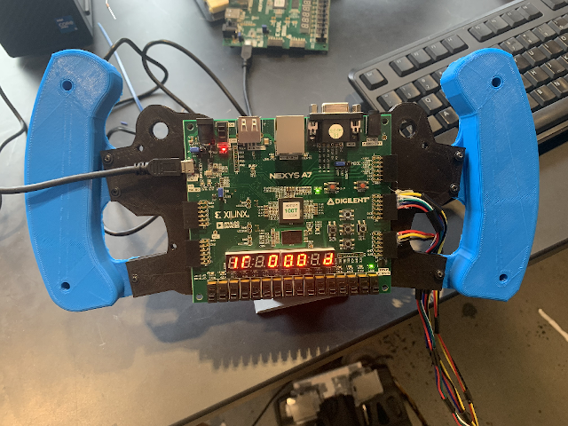
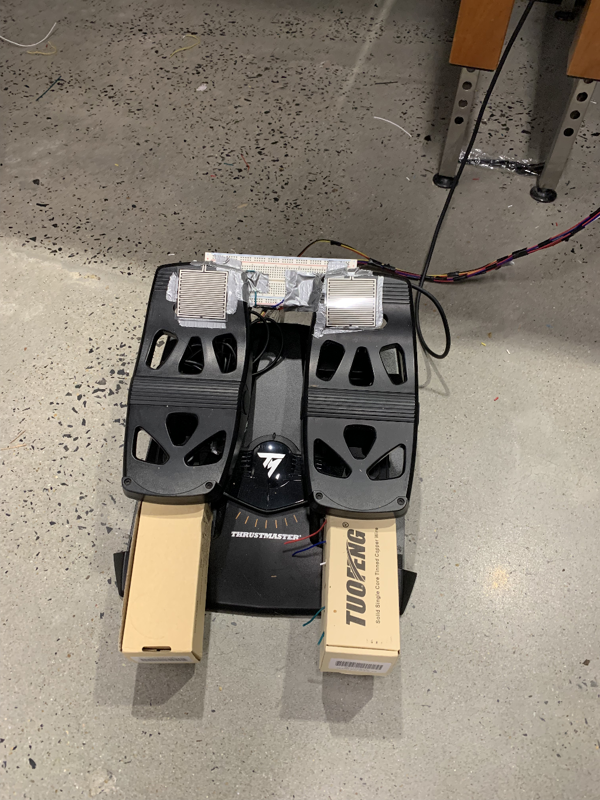

# BIM005 DriveSim

This repo contains code for an FPGA-based driving simulator powered by a 5-stage MIPS-like processor.

The driving simulator features a steering wheel, a gas and brake pedal, and a bluetooth controlled car.

The self-made processor is the central control unit and does most of the data processing. Arduino is used in sensor interfacing and bluetooth data transmission.

<i>Steering wheel</i>

<i>Foot pedals</i>

<i>Car</i>

See detailed descriptions [here]().