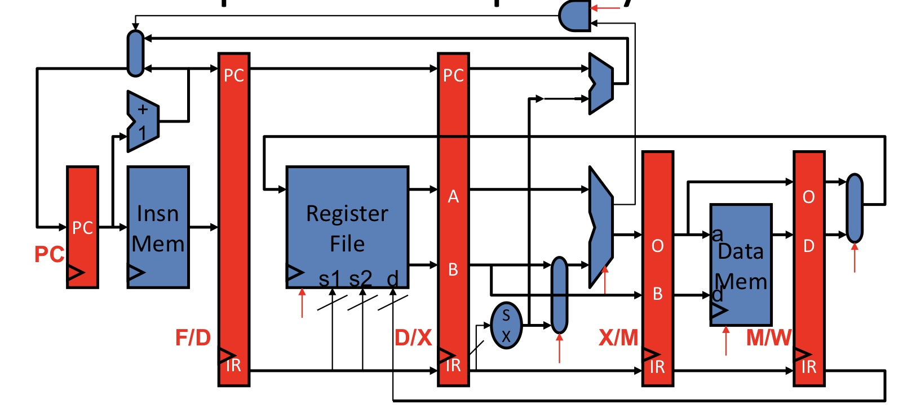

# BIM005 DriveSim

This repo contains code for an FPGA-based driving simulator powered by a 5-stage MIPS-like processor.

The driving simulator features a steering wheel, a gas and brake pedal, and a bluetooth controlled car.

The self-made processor is the central control unit and does most of the data processing. Arduino is used in sensor interfacing and bluetooth data transmission.

  

Simplified demonstration of 5-stage processor. Multplication/division and bypass/stall logic not shown. Source: Duke ECE350 lecture slides

  

Steering wheel

  

Foot pedals

  

Car

See detailed descriptions [here]().